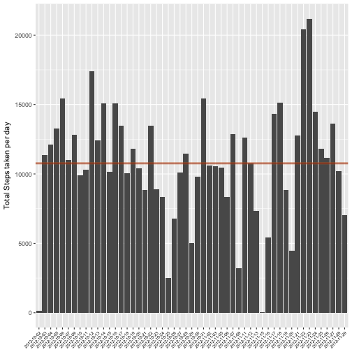
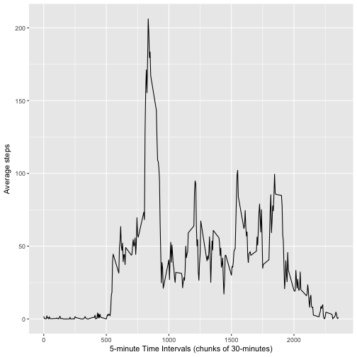
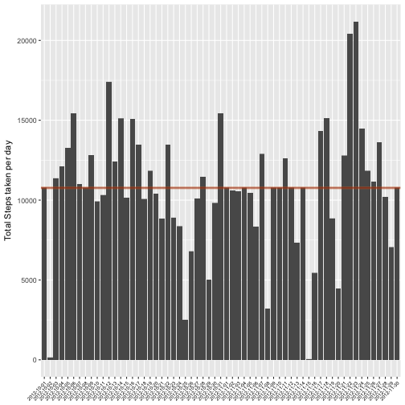
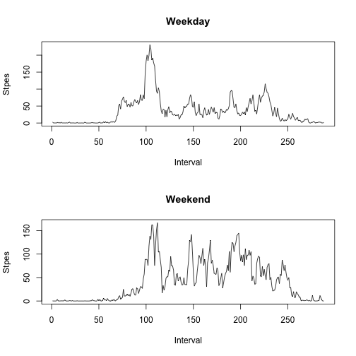

## Reproducible Research: Peer Assessment 1

### 1 - Loading and preprocessing the data

##### 1.1 - Load the data and required libraries


```r
# Load the required libraries
library(ggplot2)
library(ggthemes)

#Check if the .csv file exists. If not, extract the .zip archive. 
if(!file.exists('activity.csv')){
    unzip('activity.zip')
}

# Load the file into the "activity_df" data frame
activity_df <- read.csv('activity.csv')
```

* To get an overview of the data and what the data frame is all about.


```r
# Print the name of the attributs in the data frame.
names(activity_df)
```

```
## [1] "steps"    "date"     "interval"
```

```r
# Show the structure of the data frame.
str(activity_df)
```

```
## 'data.frame':	17568 obs. of  3 variables:
##  $ steps   : int  NA NA NA NA NA NA NA NA NA NA ...
##  $ date    : Factor w/ 61 levels "2012-10-01","2012-10-02",..: 1 1 1 1 1 1 1 1 1 1 ...
##  $ interval: int  0 5 10 15 20 25 30 35 40 45 ...
```

```r
# View the first few lines of the data frame
head(activity_df)
```

```
##   steps       date interval
## 1    NA 2012-10-01        0
## 2    NA 2012-10-01        5
## 3    NA 2012-10-01       10
## 4    NA 2012-10-01       15
## 5    NA 2012-10-01       20
## 6    NA 2012-10-01       25
```

##### 1.2 - Process/transform the data (if necessary) into a format suitable for your analysis

* Create data frame that contains completed cases by removing any NAs from any row.


```r
# Remove NAs and store in a new data frame called "activity_df_nona".
activity_df_nona <- activity_df[complete.cases(activity_df),]
```
---

### 2 - What is mean total number of steps taken per day?

* For this part of the assignment, you can ignore the missing values in the dataset 
* NAs was removed in the previous step.


```r
# Summarise the total steps data per day
total_steps <- aggregate(steps ~ date, activity_df_nona, sum)
```

##### 2.1 -  Make a histogram of the total number of steps taken each day


```r
# Plot the histogram of the non NA aggregate data frame "total_steps"
ggplot(         total_steps,aes(x = date, y= steps))  +
                geom_bar(stat = "identity") + 
                theme(axis.text.x  = element_text(size=6,
                                      angle=45,
                                      colour="black",
                                      vjust=1,
                                      hjust=1)) +
                ylab("Total Steps taken per day") +
                xlab(NULL) +
                geom_hline(aes ( yintercept = mean(total_steps$steps)), 
                        color = "chocolate3", 
                        size = 1.5, 
                        alpha = .50) +
                geom_hline(aes ( yintercept = median(total_steps$steps)), 
                        color = "darkred", 
                        alpha = .50) 
```



##### 2.2 - Calculate and report the mean and median total number of steps taken per day


```r
round(mean(total_steps$steps),2)
```

```
## [1] 10766.19
```

```r
round(median(total_steps$steps),2)
```

```
## [1] 10765
```

---

### 3 - What is the average daily activity pattern?

##### 3.1 - Make a time series plot (i.e. 𝚝𝚢𝚙𝚎 = "𝚕") of the 5-minute interval (x-axis) and the average number of steps taken, averaged across all days (y-axis)


```r
# Compute mean based on the interval
avg_interval_5_min <- aggregate(steps ~ interval, activity_df, mean)

ggplot(         avg_interval_5_min, aes(x = interval, y = steps)) +
                geom_line() +
                ylab("Average steps") + 
                xlab("5-minute Time Intervals (chunks of 30-minutes)") 
```



##### 3.2 - Which 5-minute interval, on average across all the days in the dataset, contains the maximum number of steps?


```r
# Which row contains the max mean value of the steps variable
avg_interval_5_min[which.max(avg_interval_5_min$steps),]
```

```
##     interval    steps
## 104      835 206.1698
```

---

### 4 - Imputing missing values

##### 4.1 - Calculate and report the total number of missing values in the dataset (i.e. the total number of rows with NAs)


```r
# Sum the number of NAs in the activity data frame
summary(activity_df)
```

```
##      steps                date          interval     
##  Min.   :  0.00   2012-10-01:  288   Min.   :   0.0  
##  1st Qu.:  0.00   2012-10-02:  288   1st Qu.: 588.8  
##  Median :  0.00   2012-10-03:  288   Median :1177.5  
##  Mean   : 37.38   2012-10-04:  288   Mean   :1177.5  
##  3rd Qu.: 12.00   2012-10-05:  288   3rd Qu.:1766.2  
##  Max.   :806.00   2012-10-06:  288   Max.   :2355.0  
##  NA's   :2304     (Other)   :15840
```

```r
#NA.active <- subset(activity_df, !complete.cases(activity_df))
#table(NA.active$date)
sum(is.na(activity_df))
```

```
## [1] 2304
```

##### 4.2 - Devise a strategy for filling in all of the missing values in the dataset. The strategy does not need to be sophisticated. For example, you could use the mean/median for that day, or the mean for that 5-minute interval, etc. 

* I will use the means for the 5-minute intervals as fillers for missing values. 

##### 4.3 - Create a new dataset that is equal to the original dataset but with the missing data filled in


```r
# Merge the "avg_interval_5_min" date frame with the "activity_df" joined on the interval column. Use the original data frame
new_activity_df <- merge(activity_df, avg_interval_5_min, by = "interval", suffixes = c("",".y"))

# New data frame to determine which columns has NAs in the new merged data frame and mark TRUE or FALSE
nas <- is.na(new_activity_df$steps)

# Replace the NA in steps with the average of steps.
new_activity_df$steps[nas] <- new_activity_df$steps.y[nas]

# Remove average column from the "new_activity_df" data frame
new_activity_df <- new_activity_df[, c(1:3)]
```

##### 4.4 - Make a histogram of the total number of steps taken each day and Calculate and report the mean and median total number of steps taken per day. Do these values differ from the estimates from the first part of the assignment? What is the impact of imputing missing data on the estimates of the total daily number of steps?


```r
ggplot(         new_activity_df,aes(x = date, y= steps))  +
                geom_bar(stat = "identity") + 
                theme(axis.text.x  = element_text(size=6,
                                      angle=45,
                                      colour="black",
                                      vjust=1,
                                      hjust=1)) +
                ylab("Total Steps taken per day") +
                xlab(NULL) +
                geom_hline(aes ( yintercept = mean(total_steps$steps)), 
                        color = "chocolate3", 
                        size = 1.5, 
                        alpha = .50) +
                geom_hline(aes ( yintercept = median(total_steps$steps)), 
                        color = "darkred", 
                        alpha = .50) 
```



```r
mean(new_activity_df$steps)
```

```
## [1] 37.3826
```

```r
median(new_activity_df$steps)
```

```
## [1] 0
```

---

### 5 - Are there differences in activity patterns between weekdays and weekends?

* For this part the 𝚠𝚎𝚎𝚔𝚍𝚊𝚢𝚜() function may be of some help here. Use the dataset with the filled-in missing values for this part.

##### 5.1 - Create a new factor variable in the dataset with two levels – “weekday” and “weekend” indicating whether a given date is a weekday or weekend day.


```r
new_activity_df$daytype <- ifelse(as.POSIXlt(new_activity_df$date)$wday %in% c(0,6), "weekend", "weekday")
```


##### 5.2 - Make a panel plot containing a time series plot (i.e. 𝚝𝚢𝚙𝚎 = "𝚕") of the 5-minute interval (x-axis) and the average number of steps taken, averaged across all weekday days or weekend days (y-axis). See the README file in the GitHub repository to see an example of what this plot should look like using simulated data.


```r
par(mfrow= c(2,1))

df_weekday <- aggregate(steps ~ interval, new_activity_df, subset = new_activity_df$daytype == "weekday", mean)
df_weekend <- aggregate(steps ~ interval, new_activity_df, subset = new_activity_df$daytype == "weekend", mean)

plot(df_weekday$steps,type="l", ylab="Stpes", xlab="Interval", main="Weekday")
plot(df_weekend$steps,type="l", ylab="Stpes", xlab="Interval", main="Weekend")
```




